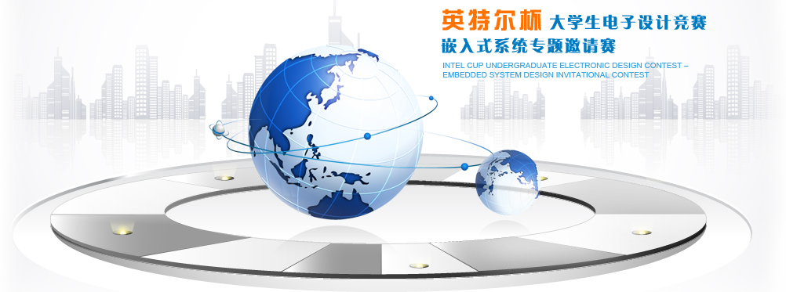
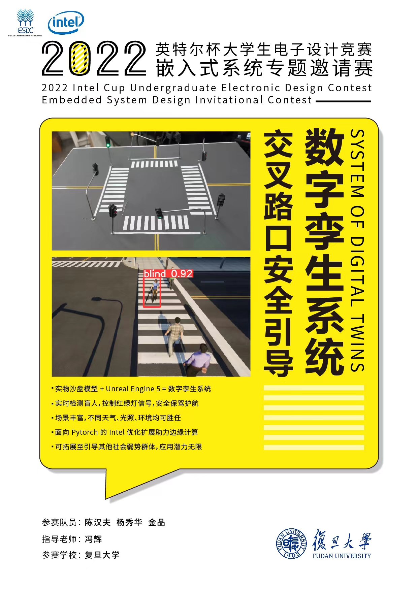

# 2022年英特尔杯全国大学生电子设计竞赛嵌入式系统设计专题邀请赛

## 复旦大学参赛队参赛作品   @陈汉夫 @金品 @杨秀华

### 交叉路口安全引导数字孪生系统

* 海报

* 成果展示

https://user-images.githubusercontent.com/68996762/188631818-3bae1496-5f68-4f3c-9a54-77abb539951e.mp4

### 声明

禁止任何组织和个人将海报、视频用于商业获其他非正当用途，违者必究。